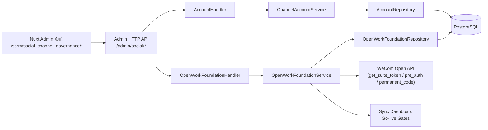
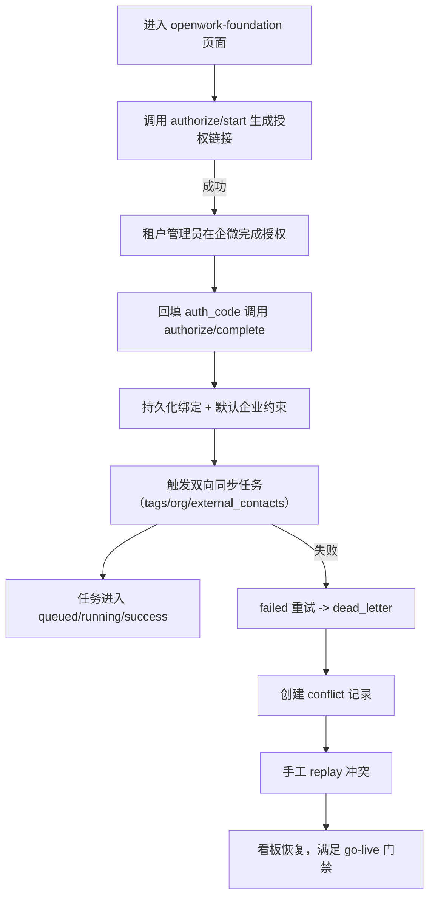
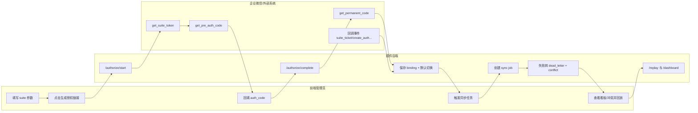

# Social Channel Governance 使用指导（版本：v1.1）

## 1. 功能背景与目标

### 1.1 为什么要做
- 业务背景：SCRM 需要统一管理多渠道账号（企微/飞书/钉钉），并把线索与组织数据连通到后续获客链路。
- 当前痛点：
  - 账号接入依赖手工填敏感参数，接入门槛高。
  - 多企业账号场景下默认账号切换规则不清晰，容易影响在跑任务。
  - 标签/组织/外部联系人未形成稳定双向同步闭环，活码能力缺乏数据基础。
- 目标收益：
  - 完成“账号治理 + 企微代开发授权 + 双向同步 + 可观测与门禁”完整基础设施。

### 1.2 本文解决什么问题
- 面向角色：研发、QA、实施、运维、产品。
- 本文范围：`specs/001-social-channel-governance` 对应能力全链路使用与验证。
- 非本文范围：具体业务策略（如标签命名规范、线索分配策略）本身。

## 2. 角色与适用范围

- 研发：联调 API、排查 handler/service/repository 链路。
- QA：按 use case 独立验收，覆盖成功与失败分支。
- 实施/运维：完成企微授权接入、默认企业账号切换、同步看板巡检。
- 适用环境：本地开发、测试环境、预发环境（生产建议先灰度租户）。

## 3. 整体架构与模块关系



- 前端模块：
  - `web-admin/app/pages/scrm/social_channel_governance/[topic].vue`
  - `web-admin/app/pages/scrm/social_channel_governance/openwork-foundation.vue`
- 后端模块：
  - `backend/internal/transport/http/admin/social_channel_governance/*`
  - `backend/internal/services/admin/social_channel_governance/*`
  - `backend/internal/entity/repository/social_channel_governance/*`
- 外部依赖：企业微信 OpenWork 开放平台接口。

## 4. 核心流程（含流程图）



## 5. 跨角色协作流程（泳道图）



## 6. 前置条件与依赖

### 6.1 配置
- 后端启动并可访问 `/api/v1`。
- 前端 `web-admin` 可连接后端 API。
- 企微代开发参数（`suite_id/suite_secret/suite_ticket`）可获取。

### 6.2 权限与数据
- 请求需具备租户上下文（`tenant_uuid`）。
- RBAC 资源：`scrm.social_channel_accounts`（读写）。
- 若要把授权结果同步回账号，需先有 `social_channel_accounts` 记录。

### 6.3 关键数据依赖
- 仅允许单租户单默认企业绑定（数据库唯一约束 + 服务层切换）。
- 同步任务依赖默认 binding 或显式 binding UUID。

## 7. 操作步骤（按场景拆分）

### 7.1 页面操作步骤
1. 动作：进入企微代开发页面。  
入口：`/scrm/social_channel_governance/openwork-foundation`。  
预期结果：显示授权向导、绑定列表、同步看板。  
失败处理：若空白/报错，先看浏览器网络请求与后端日志。

2. 动作：生成授权链接并完成授权。  
入口：填写 Suite 参数，点击“生成授权链接”，在企微授权后回填 `auth_code`。  
预期结果：绑定列表出现企业记录，状态为 `active`，可设置默认。  
失败处理：核对 `suite_ticket` 是否可用，检查 `authorize/complete` 响应错误码。

3. 动作：触发双向同步任务并处理冲突。  
入口：选择 `domain + mode` 点击“触发任务”。  
预期结果：任务列表状态变化；失败时冲突列表可见并可回放。  
失败处理：查看 dashboard 的 `dead_letter/open_conflicts` 与任务 `last_error`。

### 7.2 接口调用步骤
1. 生成授权链接：
```bash
curl -X POST 'http://127.0.0.1:8086/api/v1/admin/social/openwork/wecom/authorize/start?tenant_uuid=00000000-0000-0000-0000-000000000001' \
  -H 'Content-Type: application/json' \
  -d '{
    "suite_id":"suite-001",
    "suite_secret":"suite-secret-001",
    "suite_ticket":"ticket-001",
    "state":"state-001"
  }'
```
预期结果：返回 `authorize_url/pre_auth_code`。  
失败处理：`INVALID_REQUEST` 通常是参数缺失；`INTERNAL_ERROR` 检查企业微信接口连通。

2. 完成授权：
```bash
curl -X POST 'http://127.0.0.1:8086/api/v1/admin/social/openwork/wecom/authorize/complete?tenant_uuid=00000000-0000-0000-0000-000000000001' \
  -H 'Content-Type: application/json' \
  -d '{
    "suite_id":"suite-001",
    "suite_secret":"suite-secret-001",
    "suite_ticket":"ticket-001",
    "auth_code":"auth-code-001",
    "set_default":true
  }'
```
预期结果：返回 binding，`is_default=true`。  
失败处理：`get_permanent_code failed` 时检查授权码是否过期。

3. 触发同步任务：
```bash
curl -X POST 'http://127.0.0.1:8086/api/v1/admin/social/openwork/wecom/sync/jobs?tenant_uuid=00000000-0000-0000-0000-000000000001' \
  -H 'Content-Type: application/json' \
  -d '{"domain":"org","mode":"bootstrap","max_retries":2}'
```
预期结果：返回 job 记录，状态进入 `queued/running/success`。  
失败处理：若 `dead_letter`，查询冲突列表并执行 replay。

### 7.3 本地命令步骤
1. 启动后端：
```bash
cd /private/var/www/html/ArtisanCloud/X/PowerX/Core/Plugins/com.powerx.plugin.scrm/backend
go run ./cmd/plugin
```
2. 启动前端：
```bash
cd /private/var/www/html/ArtisanCloud/X/PowerX/Core/Plugins/com.powerx.plugin.scrm/web-admin
npm run dev
```
3. 回归测试（推荐）：
```bash
cd /private/var/www/html/ArtisanCloud/X/PowerX/Core/Plugins/com.powerx.plugin.scrm/backend
GOCACHE=$PWD/.gocache GOMODCACHE=$PWD/.gomodcache go test ./internal/transport/http/admin/social_channel_governance ./internal/services/admin/social_channel_governance -count=1
```

## 8. 预期结果与验收标准

- [ ] 可完成 `authorize/start -> complete` 主流程。
- [ ] 多企业账号下仅一个默认 binding，且默认切换后新任务命中新默认。
- [ ] `tags/org/external_contacts` 三类任务可触发。
- [ ] 失败任务可进入 `dead_letter`，冲突可 replay。
- [ ] `/sync/dashboard` 与 `/go-live-gates` 返回稳定结构。

## 9. 代码实现映射

| 文档步骤 | 代码位置 | 说明 |
|---|---|---|
| 路由注册 | `backend/internal/transport/http/admin/social_channel_governance/routes.go` | `openwork/wecom/*` 全部入口 |
| 授权 Handler | `backend/internal/transport/http/admin/social_channel_governance/openwork_foundation_handler.go` | 参数绑定、响应封装、错误映射 |
| 授权 Service | `backend/internal/services/admin/social_channel_governance/openwork_foundation_service.go` | 调企微 API、默认切换策略、任务编排 |
| 仓储层 | `backend/internal/entity/repository/social_channel_governance/openwork_foundation_repository.go` | binding/job/conflict 持久化与看板统计 |
| 数据模型 | `backend/internal/entity/models/social_channel_governance/openwork_foundation.go` | binding/event/job/conflict 表结构 |
| 迁移与索引 | `backend/cmd/database/migrate/migrate.go` | 新表迁移、默认 binding 唯一索引 |
| 前端页面 | `web-admin/app/pages/scrm/social_channel_governance/openwork-foundation.vue` | 授权向导、任务触发、看板与冲突回放 |
| 前端 API 客户端 | `web-admin/app/composables/api/services/socialChannelGovernance.ts` | OpenWork API 封装 |
| 菜单入口 | `web-admin/app/components/AppSidebar.vue` | `scrmOpenWorkFoundation` 菜单 |
| API 契约 | `specs/001-social-channel-governance/contracts/openapi.yaml` | OpenAPI 路径/Schema |
| 回归测试 | `backend/internal/services/admin/social_channel_governance/openwork_foundation_service_test.go` | 服务层主链路测试 |
| 回归测试 | `backend/internal/transport/http/admin/social_channel_governance/openwork_foundation_handler_test.go` | HTTP 层集成测试 |

## 10. 常见问题与排障

1. 问题：`tenant context missing`（401）  
定位：请求是否携带 `tenant_uuid`；中间件 `EnsureTenant`。  
处理：在 URL query 或上游上下文传入合法租户 UUID。

2. 问题：`suite_ticket is required`  
定位：是否有 `suite_ticket` 回调事件落库。  
处理：先调 `/events` 入池，或在 `authorize/start` 显式传 `suite_ticket`。

3. 问题：同步任务直接 `dead_letter`  
定位：检查 `mode=pushback` 是否缺少 `write_back_fields`。  
处理：补齐回写字段，或改用 `bootstrap/incremental`。

4. 问题：默认企业账号切换后旧任务受影响担忧  
定位：查看旧任务 `binding_uuid/channel_account_uuid` 是否已固化。  
处理：按设计旧任务不改绑定，只影响新建任务。

5. 问题：看板 `max_lag_minutes` 异常  
定位：核对 job `created_at/status`。  
处理：检查数据库时间与任务状态迁移逻辑。

## 11. 回滚与风险控制

- 变更前备份 `social_*` 新增表数据（至少 binding/job/conflict）。
- 若上线后异常：
  - 先冻结新同步任务创建入口（前端按钮或网关策略）。
  - 保留数据不删除，优先通过 replay 清理死信与冲突。
  - 必要时回滚到仅 US1-US3（账号治理）能力，暂时禁用 OpenWork 页面入口。
- 风险控制重点：
  - 不允许破坏“单默认企业账号”约束。
  - 不允许批量重置历史运行任务绑定。

## 12. 变更记录

| 版本 | 日期 | 责任人 | 说明 |
|---|---|---|---|
| v1.0 | 2026-03-26 | Codex | 初版：US1-US8 全链路使用指导 |
| v1.1 | 2026-03-26 | Codex | 补充 OpenWork API、双向同步、门禁与回归测试映射 |

## Use Case 文档索引

| 文件 | 适用角色 | 独立验收口径 |
|---|---|---|
| `usecase-us1-channel-account-onboarding.md` | 研发/QA/实施 | 账号创建与列表状态可独立跑通 |
| `usecase-us2-account-members-capabilities.md` | 研发/QA | 成员范围与能力开关可独立验收 |
| `usecase-us4-openwork-authorization.md` | 研发/实施/运维 | 企微代开发授权闭环可独立验收 |
| `usecase-us5-us8-dual-sync-reliability.md` | 研发/QA/运维 | 同步任务、冲突回放、死信看板与门禁可独立验收 |
