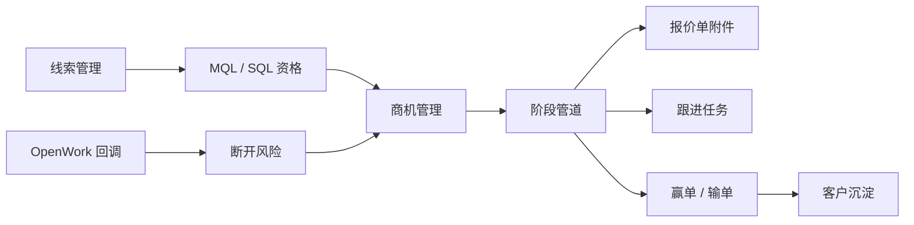
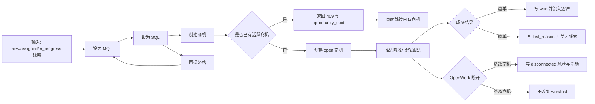
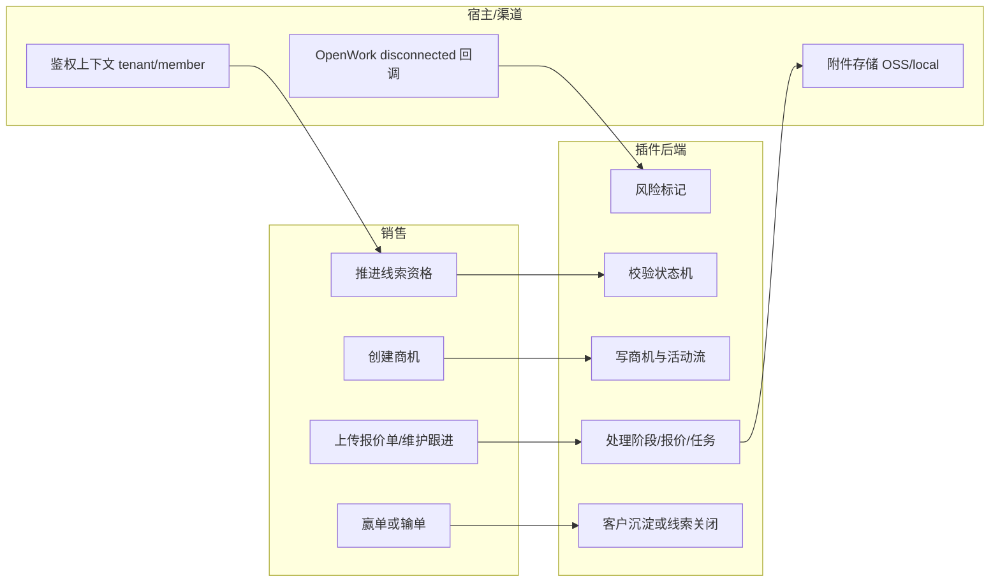

# 商机管理验收指南

本指南用于验收 `007-opportunity` 商机管理能力，覆盖从线索资格推进、创建商机、销售管道推进、赢输单、报价单、跟进任务到渠道断开风险标记的完整闭环。

## 1. 功能背景与目标

线索跟踪关注线索入池、归并、分配、触点与会话；商机管理关注已进入销售管道后的金额、阶段、预计成交、负责人、报价、跟进、赢输单和风险。

本期商机不做报价审批、合同回款、预测分析、阶段自定义和商机合并。上述能力属于后续 CRM 深化。

## 2. 角色与适用范围

- 销售：在线索详情推进 MQL/SQL，创建商机，维护报价、跟进、阶段和赢输单。
- 销售主管：在商机工作台查看阶段管道、金额、风险和负责人筛选结果。
- QA/研发：按本文档验证接口、页面入口、状态机、风险联动和回归测试。

适用环境：SCRM 插件本地模式与 PowerX 宿主模式。两种模式都要求请求上下文包含有效 `tenant_uuid` 和 `member_uuid`。

## 3. 整体架构与模块关系



## 4. 核心流程



## 5. 跨角色协作流程



## 6. 前置条件与依赖

- 已登录管理端，当前请求上下文包含有效 `tenant_uuid` 与 `member_uuid`。
- 已有线索数据，且线索状态可推进到 `mql/sql` 或已有存量 `converted` 线索。
- 负责人必须通过成员选择控件选择，不能手填无效 UUID。
- 已执行 opportunity 迁移，存在 `opportunity_records/opportunity_activities/opportunity_line_items/opportunity_tasks`。

## 7. 操作步骤

### 7.1 页面操作步骤

#### 线索详情

路径：`/scrm/lead_capture/:lead_id`

验收点：
- 分配与状态区域可执行 `设为 MQL`、`设为 SQL`、`回退资格`。
- `sql/converted` 线索可点击 `创建商机`。
- 非合格线索创建商机应显示业务错误。
- 已有活跃商机时，创建入口应跳转已有商机。

#### 商机列表

路径：`/scrm/opportunity`

验收点：
- 首屏展示活跃商机、管道金额、赢单金额、风险商机。
- 阶段管道展示 `open/qualified/proposal/negotiation/won/lost`。
- 可按关键词、阶段、负责人、来源和风险筛选。
- 新建商机弹窗必须从可建商机线索中选择，不要求复制线索 UUID。

#### 商机详情

路径：`/scrm/opportunity/:opportunity_uuid`

验收点：
- 展示金额、币种、阶段、成交概率、预计成交、负责人、来源和关联线索。
- 阶段推进需要确认。
- 终态商机禁用继续推进，保留重开。
- 可上传多份报价单附件，每份保留报价总价、文件名、文件大小、上传时间。
- 可新增跟进任务，并完成或重开任务。
- 风险 Banner 与活动流一致。

### 7.2 接口调用步骤

#### 资格推进

```bash
curl -X POST "$BASE/api/v1/admin/leads/$LEAD_UUID/qualification" \
  -H "Authorization: Bearer $USER_TOKEN" \
  -H "Content-Type: application/json" \
  -d '{"target_status":"mql"}'

curl -X POST "$BASE/api/v1/admin/leads/$LEAD_UUID/qualification" \
  -H "Authorization: Bearer $USER_TOKEN" \
  -H "Content-Type: application/json" \
  -d '{"target_status":"sql"}'
```

预期结果：接口返回更新后的 Lead，状态分别为 `mql` 或 `sql`。失败时检查当前状态是否满足状态机。

#### 创建商机

```bash
curl -X POST "$BASE/api/v1/admin/opportunity/records" \
  -H "Authorization: Bearer $USER_TOKEN" \
  -H "Content-Type: application/json" \
  -d '{
    "lead_uuid":"'$LEAD_UUID'",
    "title":"年度采购商机",
    "owner_member_uuid":"'$MEMBER_UUID'",
    "currency":"CNY",
    "probability":20
  }'
```

预期结果：接口返回 `open` 商机。非 `sql/converted` 线索返回 422，已有活跃商机返回 409 和 `opportunity_uuid`。

#### 阶段推进

```bash
curl -X POST "$BASE/api/v1/admin/opportunity/records/$OPPORTUNITY_UUID/stage" \
  -H "Authorization: Bearer $USER_TOKEN" \
  -H "Content-Type: application/json" \
  -d '{"stage":"proposal"}'
```

预期结果：商机阶段更新，并写入 `stage_change` 活动。重复推进到同阶段不重复写活动。

#### 赢输单

```bash
curl -X POST "$BASE/api/v1/admin/opportunity/records/$OPPORTUNITY_UUID/close" \
  -H "Authorization: Bearer $USER_TOKEN" \
  -H "Content-Type: application/json" \
  -d '{"result":"lost","lost_reason":"客户预算取消"}'
```

预期结果：输单写入 `lost_at/lost_reason` 并联动线索为 `closed`；赢单创建或复用客户。

#### 活动流

```bash
curl "$BASE/api/v1/admin/opportunity/records/$OPPORTUNITY_UUID/activities" \
  -H "Authorization: Bearer $USER_TOKEN"
```

预期结果：返回创建、阶段推进、报价、跟进、赢输单、风险标记等活动。

### 7.3 本地命令步骤

```bash
cd backend
GOCACHE=$PWD/.gocache GOMODCACHE=$PWD/.gomodcache go test ./internal/services/admin/lead_capture -run 'TestLeadService_UpdateQualification|TestLeadService_ImportCSV'
GOCACHE=$PWD/.gocache GOMODCACHE=$PWD/.gomodcache go test ./internal/services/admin/opportunity
GOCACHE=$PWD/.gocache GOMODCACHE=$PWD/.gomodcache go test ./internal/transport/http/webhooks -run 'TestMarkLeadDisconnected|TestBuildOpenWork'
GOCACHE=$PWD/.gocache GOMODCACHE=$PWD/.gomodcache go test ./tests/contract -run 'TestOpportunityContract'

cd ../web-admin
npm run test
npm run build
```

预期结果：上述命令通过。全量 `go test ./tests/contract` 若失败，需先区分是否为既有非商机合同用例。

## 8. 预期结果与验收标准

- Lead 可从 `new/assigned/in_progress` 推进到 `mql/sql`，并支持 `sql -> mql`、`mql -> in_progress` 回退。
- 只有 `sql/converted` 线索可创建商机，且同一 Lead 同时最多一条活跃主商机。
- 商机工作台展示指标、阶段管道和服务端筛选结果。
- 商机详情可维护阶段、报价单附件、跟进任务、赢输单、重开和风险标记。
- OpenWork 断开联系人只标记活跃商机风险，不自动改动终态商机。
- 所有写入操作使用有效 member UUID；不接受 `system` 或零 UUID 作为操作人。

## 9. 代码实现映射

| 能力 | 代码路径 |
| --- | --- |
| Lead 资格状态常量 | `backend/internal/entity/models/lead_capture/lead.go` |
| Lead 资格服务 | `backend/internal/services/admin/lead_capture/lead_service.go` |
| Lead 资格 DTO/Handler/Route | `backend/internal/dto/lead_capture/lead_status_request.go`, `backend/internal/transport/http/admin/lead_capture/lead_handler.go`, `backend/internal/transport/http/admin/lead_capture/routes.go` |
| 商机服务状态机 | `backend/internal/services/admin/opportunity/service.go` |
| 商机 HTTP 合同 | `specs/007-opportunity/contracts/opportunity.openapi.yaml` |
| 商机合同测试 | `backend/tests/contract/opportunity_contract_test.go` |
| 商机服务测试 | `backend/internal/services/admin/opportunity/service_test.go` |
| OpenWork 风险联动 | `backend/internal/transport/http/webhooks/openwork_callback_handler.go` |
| 线索详情入口 | `web-admin/app/pages/scrm/lead_capture/[lead_id].vue` |
| 前端 Lead API | `web-admin/app/composables/api/services/leadCapture.ts` |
| 商机列表/详情 | `web-admin/app/pages/scrm/opportunity/index.vue`, `web-admin/app/pages/scrm/opportunity/[opportunity_id].vue` |

## 10. 常见问题与排障

- `线索尚未达到可创建商机状态`：先在线索详情设为 SQL，或确认线索为存量 `converted`。
- `缺少有效操作人 UUID`：重新登录，确认 token 中有 `member_uuid`，不要写 `system` 或空 UUID。
- 重复创建返回 `409`：该线索已有活跃商机，直接跳转返回的 `opportunity_uuid`。
- 断开关系后商机未出现风险：确认线索活动中存在 `sync_trace`，且 payload 内 `source_account_uuid/external_wechat_id` 与 OpenWork 回调一致。
- 报价单无法下载：确认本地 `SCRM_QUOTE_STORAGE_ROOT` 或宿主 OSS 存储对象仍存在。

## 11. 回滚与风险控制

- 数据库：本期不做破坏性列重命名；`owner_user_uuid` 等物理列仍保留，语义按 member UUID 使用。
- 接口：`owner_member_uuid` 为推荐字段，保留 `owner_user_uuid` 兼容读取。
- 状态：终态 `won/lost` 需要显式重开，不因渠道断开自动变更。
- 发布：若商机迁移未执行，先回滚菜单入口或禁用 `/scrm/opportunity` 权限，避免页面访问缺表接口。
- 附件：宿主模式使用 PowerX 底座存储，本地模式使用本地存储；回滚前保留附件对象，避免报价单记录变成死链。

## 12. 变更记录

| 日期 | 版本 | 说明 | 责任人 |
| --- | --- | --- | --- |
| 2026-06-10 | 0.2.0 | 收尾 007-opportunity：补齐 Lead 资格入口、商机合同测试、风险联动、文档验收。 | Codex |
