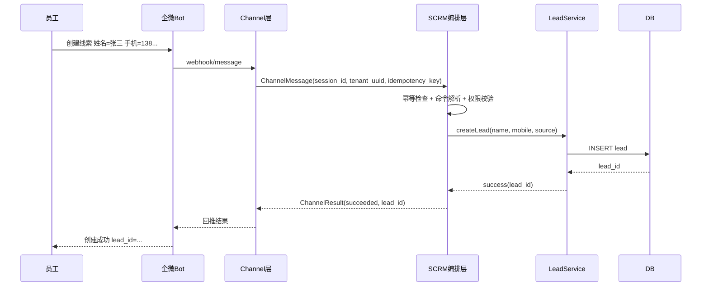

# UC-001 员工在企微 Bot 创建线索

## 实现状态

- 状态：规划中
- 与 004 关系：`specs/004-lead-managment` 未交付 Bot 命令编排创建线索链路
- 当前可复用：线索创建服务、去重合并、会话桥接基础能力

## 目标

员工通过企微 Bot 输入结构化命令后，系统创建一条新线索并返回可追踪结果。

## 业务定义（先看这个）

本用例里的“Bot 创建线索”不是 Bot 直接写数据库，而是：

1. Bot 作为消息入口。
2. SCRM 解析命令并做权限校验。
3. SCRM 业务服务真正执行“创建线索”。
4. Bot 只负责把执行结果回显给员工。

## 参与方

- 渠道：企业微信 Bot
- 执行方：SCRM Channel Orchestrator
- 业务域：Lead Service

## 前置条件

1. 员工账号已绑定渠道身份（employee_id <-> channel_user_id）。
2. 员工拥有 `scrm.lead.create` 权限。
3. 会话已存在，或允许首次消息自动建会话。

## 输入样例

- 原始文本：`创建线索 姓名=张三 手机=13800000000 来源=企微群`
- 规范消息（示例）:

```json
{
  "message_id": "msg_001",
  "session_id": "sess_001",
  "direction": "inbound",
  "content": {"type": "text", "text": "创建线索 姓名=张三 手机=13800000000 来源=企微群"},
  "idempotency_key": "wecom:chat123:seq9981",
  "timestamp": "2026-03-11T08:00:00Z"
}
```

## 处理流程

1. 接收 `channel.message.received`。
2. 幂等检查：按 `idempotency_key` 查重。
3. 解析命令并映射为 `intent=scrm.lead.create`。
4. 权限校验与参数校验（姓名、手机号格式）。
5. 调用 Lead Service 创建线索。
6. 发布 `channel.command.result` 并回推 Bot 回执。

## 时序图（职责边界）



## 成功判定

1. 数据库仅新增 1 条线索。
2. 回执包含 `lead_id` 和 `request_id`。
3. 审计日志包含 `tenant_uuid/session_id/command_id/operator`。

## 失败分支

1. 参数非法：返回 `VALIDATION_ERROR`。
2. 权限不足：返回 `FORBIDDEN`。
3. 重放请求：返回 `IDEMPOTENT_HIT`（不重复创建）。

## 开发落地建议（下一阶段）

1. 新增 Bot 命令入口（仅 WeCom）并映射到 `scrm.lead.create`。
2. 复用现有 `LeadService.Create`，不新增私有入库逻辑。
3. 幂等键统一收口到现有幂等存储，避免 Bot 链路重复实现。
